<div align="center">

  <h1>Yogadṛṣṭi (योगदृष्टि)

 🧘‍♀️✨</h1>

  <p><b>An AI-Powered Yoga Posture Analysis and Feedback System</b></p>
  
  <p>
    ॐ सर्वे भवन्तु सुखिनः सर्वे सन्तु निरामयाः<br>
    सर्वे भद्राणि पश्यन्तु मा कश्चिद्दुःखभाग्भवेत्<br>
    ॐ शान्तिः शान्तिः शान्तिः
  </p>

  <p>
    <a href="https://reactjs.org/">
      
    </a>
    <a href="https://fastapi.tiangolo.com/">
      
    </a>
    <a href="https://google.github.io/mediapipe/">
      
    </a>
    <a href="https://deepmind.google/technologies/gemini/">
      
    </a>
    <a href="https://www.mongodb.com/">
      
    </a>
    <a href="https://www.docker.com/">
      
    </a>
  </p>

  <p>
    <b>Architecture:</b> MediaPipe + Custom MLP &nbsp; | &nbsp;
    <b>LLM Feedback:</b> Gemini 3.1 Pro &nbsp; | &nbsp;
    <b>Backend:</b> FastAPI &nbsp; | &nbsp;
    <b>Frontend:</b> React + Vite
  </p>
  <p><b>Supported Poses:</b> 82 Fine-Grained Yoga Asanas</p>

</div>

---

## 📋 Table of Contents

- [Motivation & Dedication](#-motivation--dedication)
- [Application Preview](#-application-preview)
- [Video Walkthrough](#-video-walkthrough)
- [How It Works (For Laymen)](#-how-it-works-for-laymen)
- [The Challenges \& Complexities](#-the-challenges--complexities)
- [Model Selection \& Performance](#-model-selection--performance)
- [Scoring Methodology \& Feedback](#-scoring-methodology--feedback)
- [Key Features](#-key-features)
- [Directory Structure](#-directory-structure)
- [Tech Stack Explained](#-tech-stack-explained)
- [Installation \& Usage](#-installation--usage)
- [API Endpoints](#-api-endpoints)
- [Version 2 Roadmap](#-version-2-roadmap)
- [Credits \& Acknowledgments](#-credits--acknowledgments)
- [License](#-license)

---

## ✨ Motivation

The primary motivation for creating **Yogadṛṣṭi (योगदृष्टि)** was my deep desire to master as many Yoga poses as possible. 

I built this tool to aid me in correcting my posture and to offer suitable guidance during my home practice. However, I want to emphasize: **This tool is not intended to, and will never replace an actual Yoga trainer.** 

---

## 📸 Application Preview

Below is a walkthrough of the Yogadṛṣṭi's (योगदृष्टि) user interface and core functionality.

### 1. New User Registration
Users can create a persistent profile to track their progress.
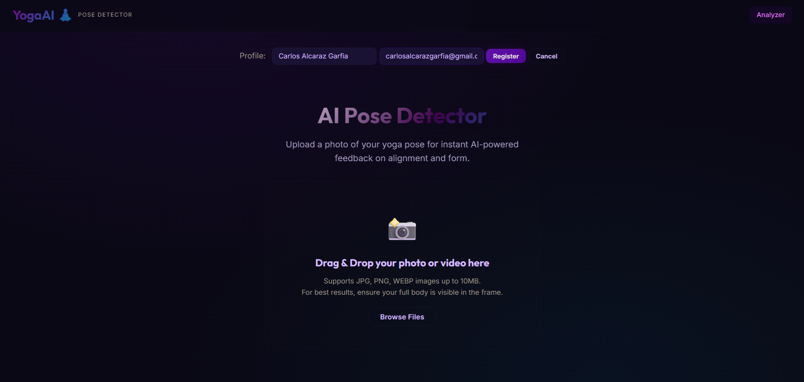

### 2. Profile Created Successfully
A confirmation of the newly registered user profile.
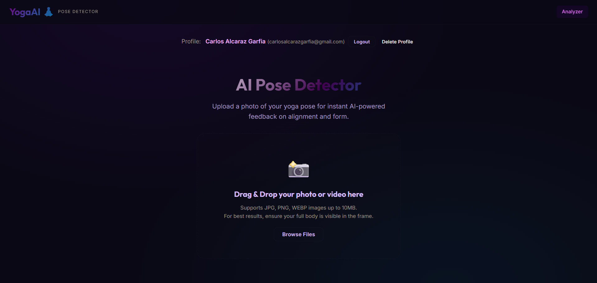

### 3. Application Dashboard (Frontend UI)
The main interface where users can interact with the system.
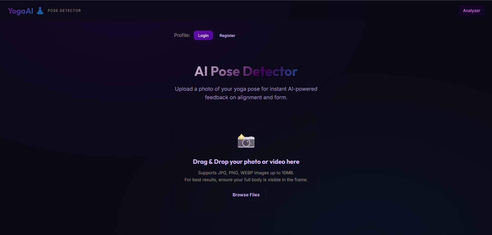

### 4. Backend Service Running
The FastAPI backend ensuring smooth operations and API handling.


### 5. Uploading a Pose
The process of uploading a yoga asana (e.g., Eagle Pose) for analysis.
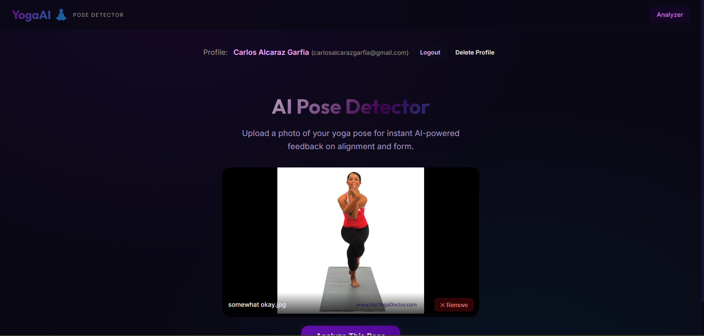

### 6. AI Analysis in Progress
The system extracting landmarks and classifying the pose in real-time.
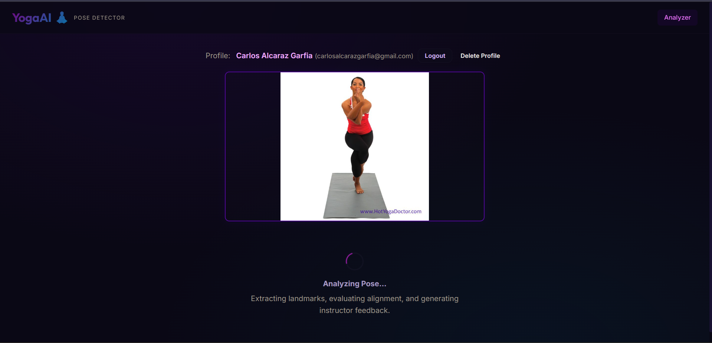

### 7. AI-Powered Feedback (Part 1)
Detailed posture corrections and scoring for the Eagle Pose.
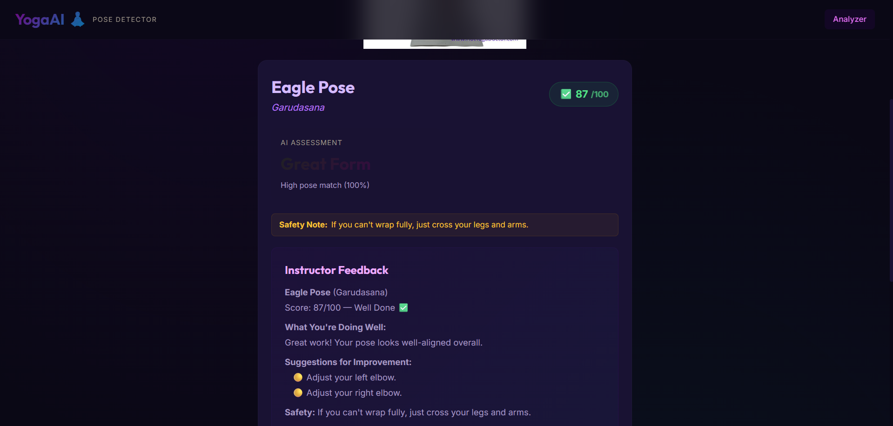

### 8. Feedback & Practice History (Part 2)
Extended feedback and historical progress tracking.
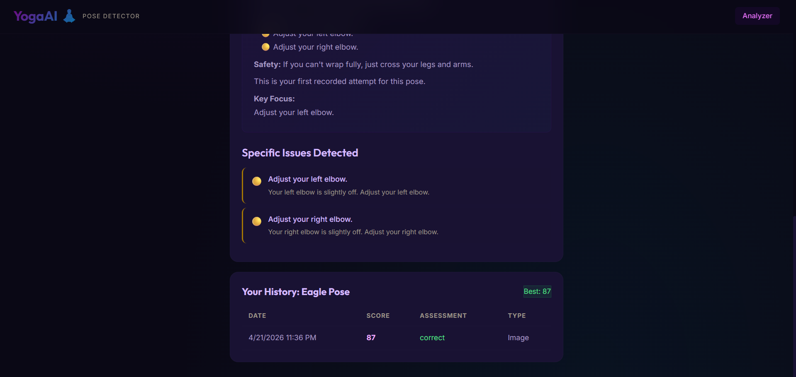

### 9. Incorrect Form Detection
The system identifying errors in a Boat Pose attempt.
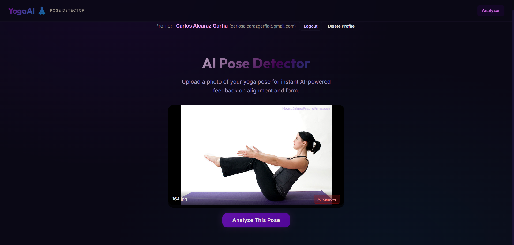

### 10. Detailed Feedback on Incorrect Form (Part 1)
Specific instructions on how to correct the Boat Pose alignment.
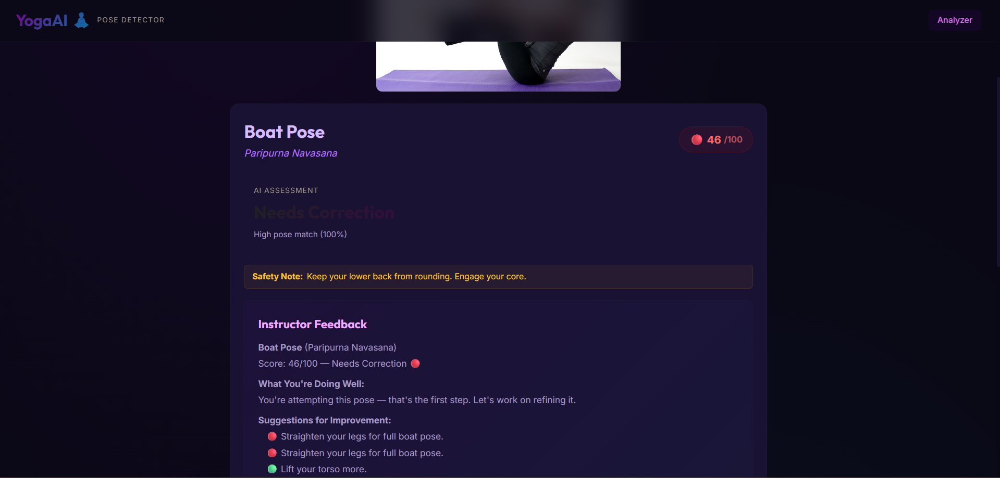

### 11. Detailed Feedback on Incorrect Form (Part 2)
Further guidance and history update for the incorrect attempt.
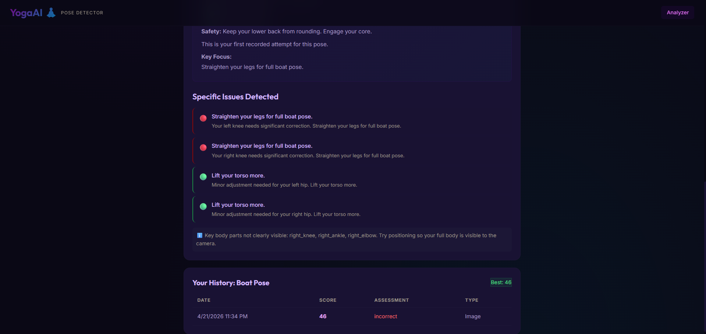

### 12. Handling Non-Yoga Images
The system gracefully failing when a non-yoga object (e.g, My Babolat tennis racquet) is uploaded.
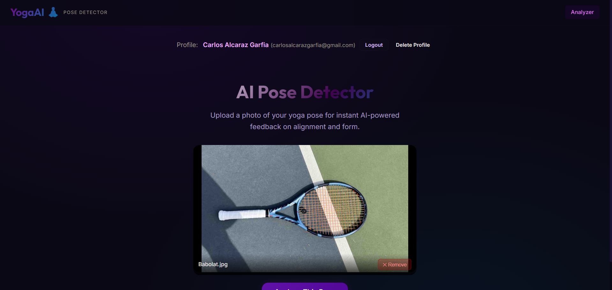

### 13. Analysis Error: No Person Detected
Error message displayed when the AI cannot find a human figure in the image.
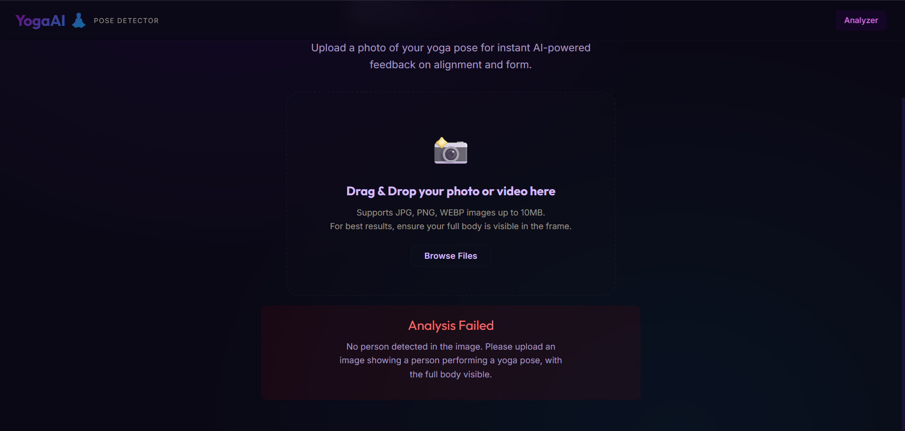

### 14. Handling Multiple People
Uploading an image with two people to test the system's single-person constraint.
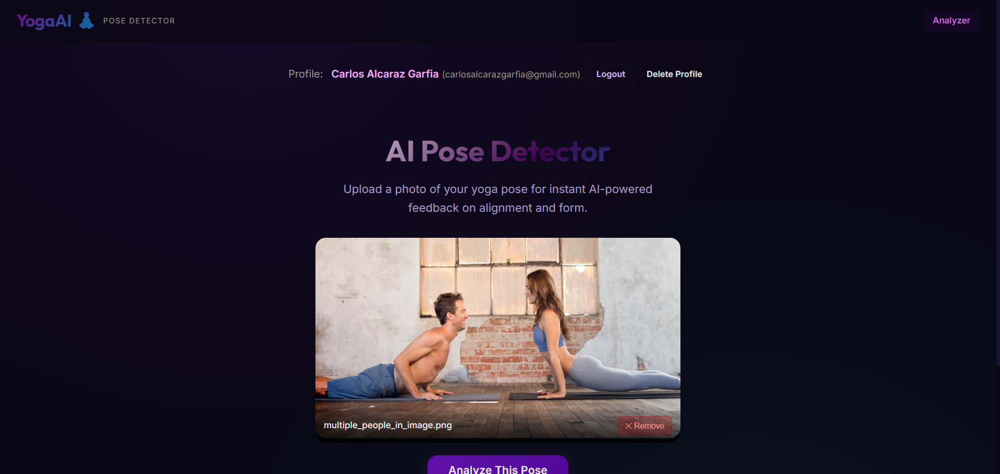

### 15. Analysis Error: Multiple People Detected
The system rejects images with more than one person to ensure analysis accuracy.
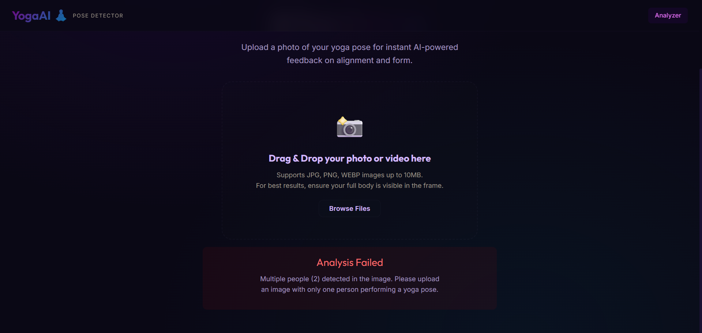

---

## 🎥 Video Walkthrough

[Placeholder: Demo Video Link]

---

## 🧩 How It Works (For Laymen)

You don't need to be a tech wizard to understand how this app works. Here is the simple, step-by-step workflow:

1. **Upload a Photo:** You upload a picture of yourself doing a Yoga pose.
2. **Body Mapping (The Skeleton):** The AI scans your image and draws a highly accurate "stick figure" over your body, locating key joints like your shoulders, hips, and knees. 
3. **Pose Guessing:** The system then compares your stick figure's angles to thousands of known Yoga poses to identify exactly which of the 82 supported poses you are trying to do.
4. **Scoring:** It checks your specific joint angles against the "perfect" form of that specific pose, calculating a score out of 100.
5. **AI Instructor Feedback:** Finally, it takes your score and the mistakes it found, and passes them to a highly intelligent AI (Google Gemini). This AI acts like a virtual instructor, writing out a personalized, encouraging message explaining exactly what you are doing well and what you need to adjust (e.g., "Straighten your left knee," or "Lower your hips").

---

## 🧗 The Challenges & Complexities

This is **not like a simple dog vs. cat classifier**. Identifying Yoga poses is a highly complex computer vision problem for several reasons:

- **Subtle Inter-class Variations:** This system classifies **82 distinct Yoga poses**. Many poses look incredibly similar (e.g., Warrior I vs. Warrior II), where the only difference might be the slight rotation of a hip or the angle of a foot. 
- **Capturing Angles & Suggesting Improvements:** It's not enough to just say "You are doing Tree Pose." The system must mathematically compute the geometric angles of your joints, compare them against a deterministic rule engine, and translate those raw numbers into human-readable instructions.
- **Paywalled Data:** Getting high-quality text materials describing the perfect alignment for 82 poses is very hard. Most authoritative Yoga guide materials are hidden under paywalls (e.g., YogaJournal.com). 
- **Cost Limitations:** Because of the paywalls and data scarcity, scraping vast amounts of data to use a RAG (Retrieval-Augmented Generation) approach was not economically feasible. 
- **The Solution:** Instead of RAG, I utilized a heavily grounded prompt engineering approach. Initially, the project used the free Groq Cloud API, but to ensure high-quality, hallucination-free instruction, I migrated to the paid **Google Gemini 3.1 Pro API**. The system now strictly instructs the LLM to base its feedback on authoritative sources (tummee.com, yogapoint.com) using the highly standardized **Sanskrit** names as the primary retrieval key.

---

## 🧘 The Supported Poses (Subset)

While the AI model has been extensively trained on a granular dataset to recognize **82 distinct Yoga poses**, here is a brief 4x4 snapshot of 16 of the foundational asanas supported by the system (not limited to this list):

| Column 1 | Column 2 | Column 3 | Column 4 |
|----------|----------|----------|----------|
| *Adho Mukha Svanasana* (Downward Dog) | *Trikonasana* (Triangle Pose) | *Virabhadrasana I* (Warrior I) | *Virabhadrasana II* (Warrior II) |
| *Vrikshasana* (Tree Pose) | *Bakasana* (Crane Pose) | *Bhujangasana* (Cobra Pose) | *Balasana* (Child's Pose) |
| *Chaturanga Dandasana* (Four-Limbed Staff) | *Ustrasana* (Camel Pose) | *Paschimottanasana* (Seated Forward Bend) | *Halasana* (Plow Pose) |
| *Sarvangasana* (Shoulder Stand) | *Matsyasana* (Fish Pose) | *Navasana* (Boat Pose) | *Tadasana* (Mountain Pose) |

---

## 🤖 Model Selection & Performance

The core pose identification relies on analyzing the geometric relationships between body landmarks. To achieve optimal classification across the 82 poses, several machine learning architectures were rigorously tested:

- **Random Forest & SVM:** Provided decent baselines but struggled with the high-dimensional feature space of complex, overlapping poses.
- **XGBoost:** Delivered strong performance, but the accuracy began to saturate.
- **The Winner - Custom Multi-Layer Perceptron (MLP):** We designed a deep, sequential Neural Network (MLP) with Batch Normalization and Dropout layers. This architecture effectively captured the non-linear relationships between joint angles and distances, achieving a peak **Top-1 Accuracy of 81.3%** on the validation set.

**Accuracy Note:** For a highly granular task involving 82 distinct classes with massive intra-class variance (different body types, camera angles, clothing), an accuracy score hovering near 81% is exceptionally good. While simpler models started to plateau around an accuracy saturation point of ~73-79%, and XGBoost peaked at 81.0%, the custom MLP pushed past it by learning the deeper structural symmetries of the human body rather than relying on surface-level visual features.

---

## 📐 Scoring Methodology & Feedback

The system uses a sophisticated hybrid approach to evaluate yoga postures, combining deterministic geometry with generative AI.

### 1. Geometric Rule Engine
Once a pose is correctly identified, the system hands the landmark data over to a deterministic Rule Engine. This engine defines strict "Expected Angles" for key joints for that specific pose.
- **Angle Scoring:** Each joint angle is compared to its target range. The score is 1.0 if within the range and linearly degrades to 0 as the deviation reaches 45°.
- **Alignment Checks:** The engine evaluates global postural metrics like shoulder levelness, hip alignment, and spine verticality using coordinate differences.
- **Weighted Aggregation:** Individual angle and alignment scores are weighted by their importance to the specific pose and averaged to produce a final score out of 100.

### 2. Instructor Feedback via LLM
The raw mathematical deviations are sent to **Gemini 3.1 Pro** via a carefully crafted system prompt. The LLM processes these numbers and generates a 3-part response:
1. **What You're Doing Well:** Positive reinforcement of correct alignment.
2. **Suggestions for Improvement:** Actionable, layman-friendly corrections based *only* on the detected deviations.
3. **Key Focus:** A single major takeaway for your next practice.

### 3. Fallback Mechanism
If the Gemini API times out or fails, the application does not crash. It seamlessly falls back to a deterministic, template-based feedback generator that provides basic, geometric corrections based directly on the scoring engine.

---

## ✨ Key Features

- **Robust User Management:** Users can create persistent profiles. The system enforces strict email deduplication (normalizing aliases like `user+tag@gmail.com` and `u.s.e.r@gmail.com`) to prevent duplicate accounts.
- **Cross-Device Login:** Login seamlessly across devices using your registered email.
- **Image Quality Restrictions:** The system employs a "Confidence Gate." If an image is too blurry, too low resolution (< 120px), or if essential body landmarks are hidden off-camera, the system gracefully rejects the image or flags the analysis as "Low Confidence" rather than giving bogus feedback.
- **Data Persistence:** All pose attempts, scores, and historical progress comparisons are saved securely to the cloud.

---

## 📂 Directory Structure

```text
Yoga_AI_Pose_Detector/
│
├── backend/                    # FastAPI Backend Application
│   ├── app/
│   │   ├── api/                # API Endpoints (users, analysis, jobs)
│   │   ├── core/               # Core Logic (LLM, Pose Detection, Scoring)
│   │   ├── db/                 # MongoDB Database connection & queries
│   │   ├── models/             # Pydantic Schemas & ML Models
│   │   └── services/           # Image Processing, Video Sampler & Training
│   ├── Dockerfile
│   ├── pyproject.toml
│   └── .env.example
│
├── frontend/                   # React + Vite Frontend Application
│   ├── src/
│   │   ├── components/         # UI Components (ResultCard, FileUpload, etc.)
│   │   ├── services/           # Axios API Client
│   │   └── index.css           # Styling
│   ├── Dockerfile
│   ├── nginx.conf
│   └── package.json
│
├── docker-compose.yml          # Container Orchestration
├── LICENSE
└── README.md
```

---

## 🛠️ Tech Stack Explained

- **MediaPipe:** Chosen for its state-of-the-art, lightning-fast human pose estimation. It extracts 33 3D body landmarks incredibly efficiently, which forms the core data for our analysis without requiring heavy GPU compute on the server.
- **FastAPI (Backend):** Python framework used for its high performance, native async support (crucial for long AI LLM network calls), and easy Pydantic data validation.
- **React + Vite (Frontend):** Selected for a modern, highly responsive, and snappy user interface.
- **MongoDB Atlas:** A NoSQL cloud database used to store user profiles and pose history. Chosen because the deeply nested nature of pose metrics and historical arrays maps perfectly to JSON-like documents.
- **Google Gemini 3.1 Pro:** Chosen for the final phase over free alternatives to ensure the highest quality, most precise, and heavily grounded instructor feedback.
- **Docker:** Used to containerize the entire application. Why Docker? It ensures that the app runs exactly the same way on my local machine, a friend's laptop, or a cloud server. It eliminates the "it works on my machine" headache, especially when dealing with complex system dependencies like OpenCV and Node.js working side-by-side.

---

## 🚀 Installation & Usage

### Prerequisites
- Git
- Docker and Docker Compose (Recommended)
- OR Python 3.9+ and Node.js 20+
- A Google Gemini API Key
- A MongoDB Atlas Cluster URI

### Step 1: Clone the Repository
```bash
git clone https://github.com/your-username/Yoga_AI_Pose_Detector.git
cd Yoga_AI_Pose_Detector
```

### Step 2: Configure Secrets
Create a `.env` file in the `backend/` directory:
```env
GEMINI_API_KEY=your_gemini_api_key_here
MONGODB_URI=your_mongodb_cluster_uri_here
MONGODB_DB_NAME=yoga_pose_detector
```

### Step 3: Run via Docker (Easiest Method)
```bash
docker compose up --build
```
- The **Frontend** will be available at `http://localhost:80`
- The **Backend API** will be available at `http://localhost:8000`

### Optional: Run Locally (Without Docker)
**Backend:**
```bash
cd backend
python -m venv .venv
source .venv/bin/activate  # Or .venv\Scripts\activate on Windows
pip install -r requirements.txt
python -m uvicorn app.main:app --reload --port 8000
```

**Frontend:**
```bash
cd frontend
npm install
npm run dev
```

---

## 📡 API Endpoints

- `POST /api/v1/users` - Register a new user
- `POST /api/v1/users/login` - Login via email
- `POST /api/v1/analyze/image` - Submit an image for pose evaluation
- `POST /api/v1/analyze/video` - Submit a short video for frame-by-frame analysis
- `GET /api/v1/users/{id}/history` - Retrieve a user's pose history
- `DELETE /api/v1/users/{user_id}` - Safely delete user profile and cascade delete records

*(Automated Unit Tests and Integration Tests have been implemented for all core endpoints and logic modules).*

---

## 💻 Backend Interfaces (Swagger & ReDoc)

The FastAPI backend automatically generates robust, interactive REST API documentation allowing developers to visualize and interact with the API endpoints without needing to connect the frontend.

### Fully Interactive Swagger Docs
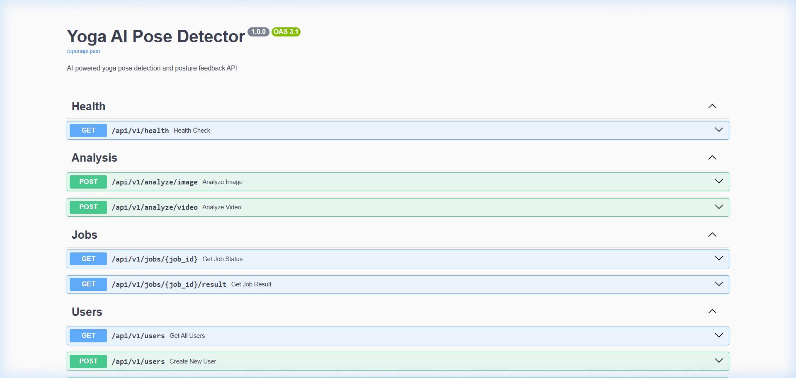

### Strict ReDoc Specifications
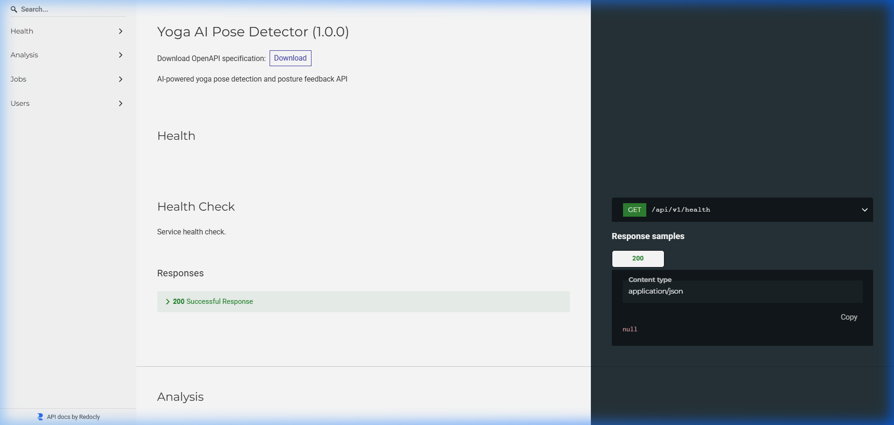

---

## 🔮 Version 2 Roadmap

The journey to perfect Yoga alignment doesn't stop here. For Version 2 of Yogadṛṣṭi (योगदृष्टि), I plan to implement:

1. **Advanced Model Architectures:** Exploring `EfficientNet` and Vision Transformers (ViT) to further push the boundaries of pose classification accuracy.
2. **Personalized Analytics:** Interactive, personalized analysis charts for each registered user, tracking joint flexibility and score trends over time for individual body parts.
3. **Advanced Video Processing:** Refined ability to stream and process short videos in near real-time, providing dynamic feedback across the flow of a movement rather than a static frame.

---

## 🎓 Credits & Acknowledgments

- **Yoga-82 Dataset:** Deep gratitude to the creators of the dataset that made this project's training phase possible: *Yoga-82: A New Dataset for Fine-grained Classification of Human Poses* (Yuta and Raman, Shanmuganathan, Sudhakar and Nakashima). The ~28,000 images defining 82 hierarchical classes provided the foundation for our classifier.

---
*AI might someday out-code me, refactor me, but not replace me -
and it'll still be miles away from the clarity & support you would receive from a skilled Yoga trainer!🙏🏻*
